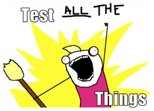
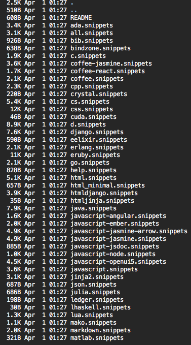
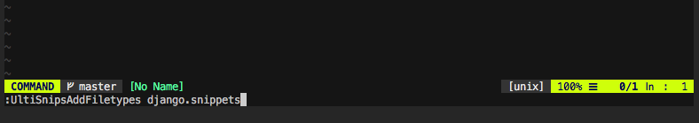

# Django-1.11-TDD-full-examples

  

# Agile!!
# TDD!!

  

# Double Loop TDD!!!!!!!

"""
CTAGS 
$ ctags -R --languages=python .

(into vim command mode)
:tj NAME   # TagJump to NAME      ==    Ctrl + ]
:stj NAME  # Split and Tag JUMP to NAME

:po # Get Back                    ==    Ctrl + t
"""

#VIM SNIPPETS  AWESOME....

  

##

  

